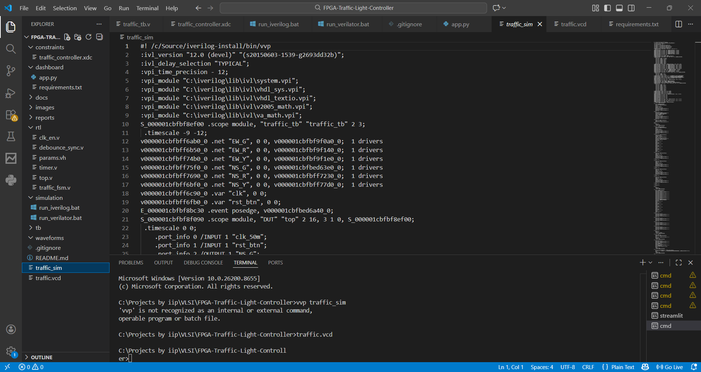
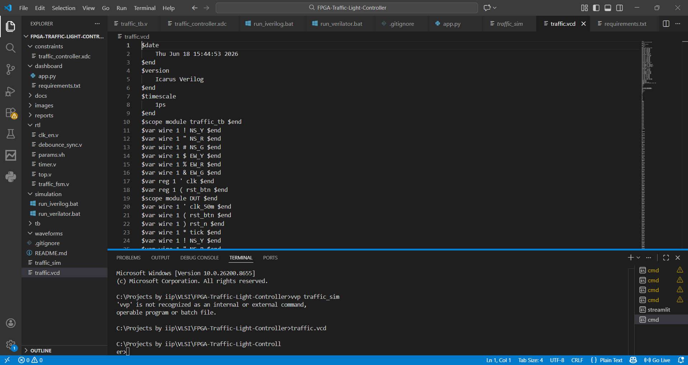
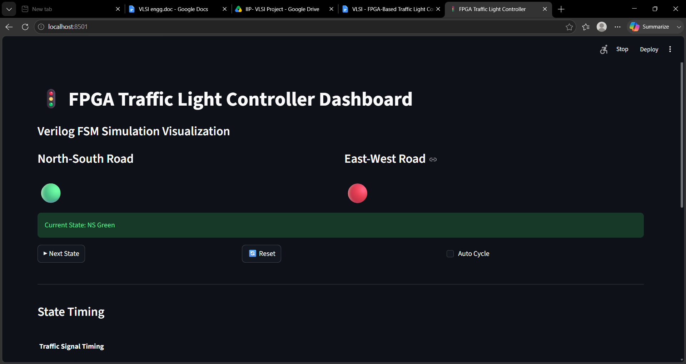
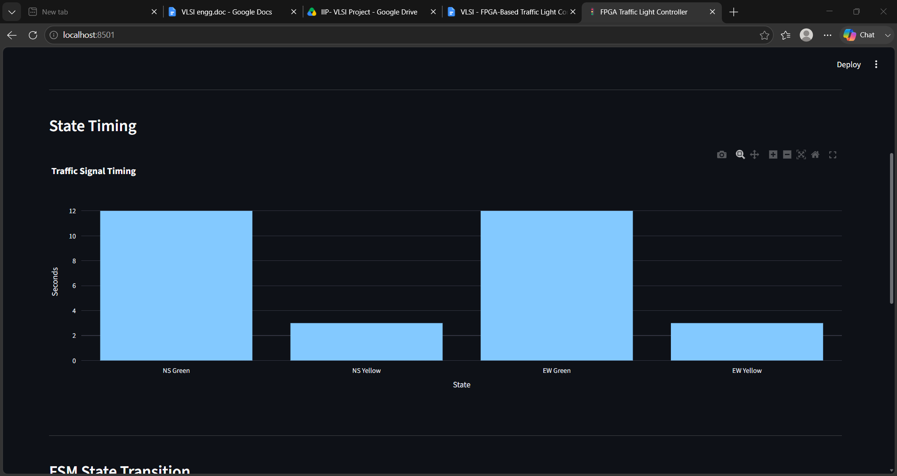
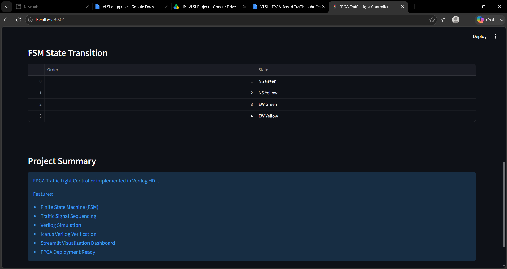

# 🚦 FPGA-Based Traffic Light Controller with Streamlit Dashboard


---

# 📌 Project Overview

The **FPGA-Based Traffic Light Controller** is a digital design project implemented using **Verilog HDL** and **Finite State Machine (FSM)** architecture.

The project simulates a real-world 4-way traffic intersection controller where traffic lights change according to predefined timing sequences.

A professional **Streamlit dashboard** is integrated to visualize:

- 🚦 Live traffic signal states
- ⏱ Timing behavior
- 📊 FSM transitions
- 🔄 Controller operation

This project demonstrates concepts from:

- VLSI Design
- FPGA Development
- RTL Design
- Digital Logic
- Hardware Verification

---

# 🎯 Objective

Design and verify a parameterized traffic light controller using:

- Verilog HDL
- FSM based control logic
- Clock divider
- Sequential and combinational logic
- Testbench verification

The system controls:

- North-South traffic
- East-West traffic

with safe signal transitions.

---

# 🏗️ System Architecture


          Clock Input
               |
               |
         Clock Divider
               |
               |
          FSM Controller
               |
               |
      Traffic Light Logic
               |
               |
    -------------------------
    |                       |

North-South East-West
Traffic Lights Traffic Lights


---

# 🔥 Features


## Hardware Design

✅ Verilog RTL Implementation  
✅ FSM Based Controller  
✅ Clock Divider  
✅ Reset Logic  
✅ Modular Design  


## Simulation

✅ Icarus Verilog Simulation  
✅ Testbench Verification  
✅ VCD Waveform Generation  


## Dashboard

✅ Streamlit Interface  
✅ Animated Traffic Signals  
✅ FSM Monitoring  
✅ Timing Charts  
✅ Interactive Controls  


---

# 🧠 FSM Design


The controller contains four main states:


| State | North-South | East-West |
|-|-|-|
| S0 | 🟢 Green | 🔴 Red |
| S1 | 🟡 Yellow | 🔴 Red |
| S2 | 🔴 Red | 🟢 Green |
| S3 | 🔴 Red | 🟡 Yellow |


FSM Flow:


S0
|
v
S1
|
v
S2
|
v
S3
|
v
S0


---

# 📂 Project Structure


FPGA-Traffic-Light-Controller

│
├── rtl
│ ├── clk_en.v
│ ├── traffic_fsm.v
│ ├── timer.v
│ └── top.v
│
├── tb
│ └── traffic_tb.v
│
├── simulation
│ └── traffic.vcd
│
├── dashboard
│ ├── app.py
│ └── requirements.txt
│
├── constraints
│ └── traffic_controller.xdc
│
├── images
│ ├── project_structure.png
│ ├── simulation.png
│ ├── waveform.png
│ └── dashboard.png
│
├── reports
│
├── README.md
└── .gitignore


---

# 🛠️ Tools Used


### Hardware Design

- Verilog HDL
- FPGA Architecture
- FSM Design


### Simulation

- Icarus Verilog
- GTKWave


### Visualization

- Python
- Streamlit
- Plotly
- Pandas


---

# ▶️ Simulation


## Compile


```bash
iverilog -o traffic_sim rtl/clk_en.v rtl/traffic_fsm.v rtl/top.v tb/traffic_tb.v
Run
vvp traffic_sim

Output:

VCD info: dumpfile traffic.vcd opened for output

📊 Streamlit Dashboard

Install dependencies:

cd dashboard

pip install -r requirements.txt

Run:

streamlit run app.py

Dashboard Features:

Real-time traffic light display
FSM state tracking
Timing visualization
Controller monitoring
📸 Project Screenshots
1. Project Structure

# 📸 Project Screenshots


# 📸 Project Screenshots


## 🚦 Traffic Simulation




---

## 📈 VCD Waveform




---

# 🖥️ Streamlit Dashboard


## Dashboard View 1




## Dashboard View 2




## Dashboard View 3




Interactive dashboard showing:

Current traffic state
Signal visualization
Timing charts
🔬 Verification

The testbench verifies:

✔ Clock operation
✔ Reset behavior
✔ FSM transitions
✔ Correct traffic sequence
✔ No conflicting green signals

🚀 FPGA Implementation Flow
Verilog RTL

      ↓

Synthesis

      ↓

Implementation

      ↓

Bitstream Generation

      ↓

FPGA Programming

      ↓

LED Traffic Simulation

🌍 Real World Applications

This design concept is used in:

Smart city traffic systems
Industrial automation
Embedded controllers
Automotive electronics
Digital control systems
🔮 Future Improvements

Future upgrades:

🚶 Pedestrian crossing support
🚑 Emergency vehicle priority
🚗 Vehicle density sensors
🌐 IoT traffic monitoring
🤖 AI based adaptive traffic control
🎓 Learning Outcomes

Through this project:

Designed RTL modules using Verilog
Implemented FSM based hardware controller
Created verification environment
Generated simulation waveforms
Developed FPGA-ready architecture
Built hardware visualization dashboard
👩‍💻 Author

Sanskritika Awasthi

VLSI | FPGA | Verilog | Digital Design